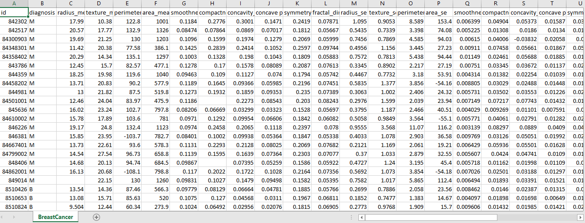
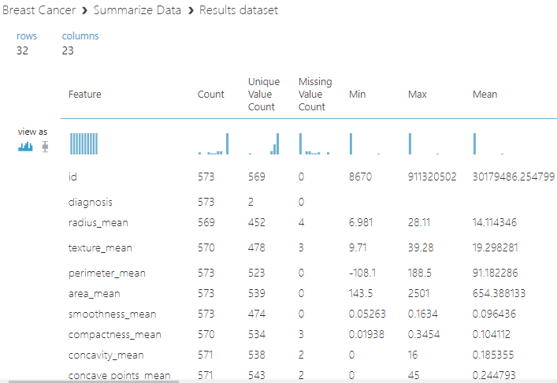
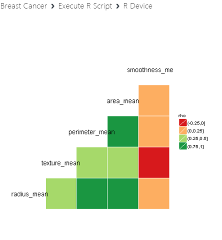
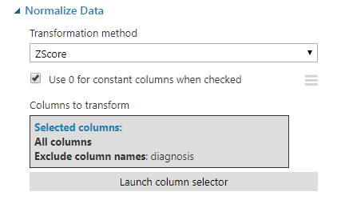
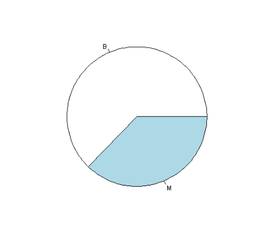

# Wisconsin Breast Cancer Data for Classification Analysis

Please click [here](https://gallery.azure.ai/Experiment/Breast-Cancer-2) to view & download the experiment.

  
  

## Objective
Early cancer detection and prognosis is one of the most important healthcare areas where machine learning techniques are being applied.
The second leading cause of death among women is breast cancer, as it comes directly after lung cancer. More than one million cases and nearly 600,000 deaths occurring worldwide annually.
`The experiment aims to predict instances of breast mass collected as Malignant or Benign`.

## Data Description
Please click [here](Dataset/BreastCancer.csv) to view the dataset. 

This dataset consists of 573 samples & 32 features describing the characteristics of a cell nuclei taken from a digitized image of a breast mass.
1) ID number 2) Diagnosis (M = malignant, B = benign)
 3-32)  Ten real-valued features are computed for each cell nucleus:
* Radius: (mean of distances from center to points on the perimeter)
* Texture (standard deviation of gray-scale values) 
* Perimeter
* Area 
* Smoothness (local variation in radius lengths) 
* Compactness (perimeter^2 / area - 1.0) 
* Concavity (severity of concave portions of the contour) 
* Concave points (number of concave portions of the contour) 
* Symmetry 
* Fractal dimension ("coastline approximation" - 1)
The mean, standard error and "worst" or largest (mean of the three largest values) of these features were computed for each image, resulting in 30 features. For instance, field 3 is Mean Radius, field 13 is Radius SE, field 23 is Worst Radius.
Missing attribute values: Yes
##### Class distribution: `357 benign, 212 malignant`

Please have a glimpse of the dataset

## Tool & Algorithms used

The entire experiment was conducted in Azure ML Studio where Azure ML Studio modules, R Script has been used.
`Support Vector Machine` has been used as standalone algorithm for this analysis.

## Code snippets
### Loading the data
The data was collected from Kaggle and uploaded on Azure ML data repository.
### Summary of the data

### Data Wrangling
Data Wrangling is essential part of Data Analysis to prepare the data best before further analysis.Data Wrangling involves Missing Value detection & replacement, outlier detection,transforming data into absolute form,Standardization so on & so forth.

## Correlation plot

### Missing Value Replacement
#### MICE method

#### Quick recheck of Missing cells if any
.PNG)

### Finding duplicate rows

#### R code
.PNG)

#### Output

### Transforming negative values into absolute form

### KS-test for Normality test

### Normalization of the dataset

### Plots after Missing Value replacement

##### Correlation plot
after%20MV%20replacement.PNG)

##### Density plots 
Density plot helps to know the distribution of variables.

###### Below density plots were drawn in respect to Output variable(Benign or Malignant)

#### Pie plot for Output variable(Diagnosis)

![alt-txt](Breast_Cancer_Images/pie%20plot%20for%20diagnosis%20var.PNG]

#### Output

  

  

  

 

#### Split the data into train & test set for further analysis

 
 

 

#### Parameters of Support Vector Maachine

  

#### Final outcome of the analysis

### Future Scope
Machine Learning continues to keep promises in whatever the field of study is given data is available.The powerful algorithmns of ML are being widely used in Medical Science to diagnose as deadly diseases like cancer, genetic disorder,predict probable places to be affected with any contiguous diseases on alarm so on & so forth.

