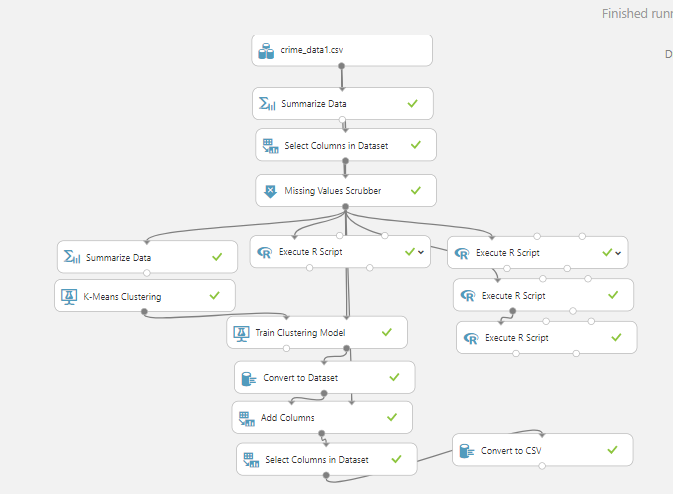
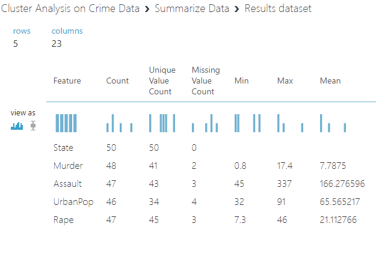
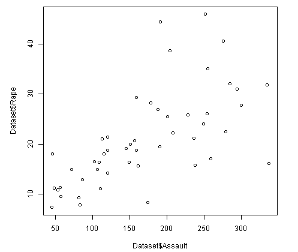

# Crime data for cluster analysis in Azure ML Studio
Please click [here](https://gallery.azure.ai/Experiment/Cluster-Analysis-on-Crime-Data) to view the project

  
  

## Objective
The objective of the project is to assign the cases of different sorts of crime across fifty states of the USA in 1973 to groups based on similarity each case exhibits among themselves & take appropriate action for each group based on behaviour shown by them

## Dataset description
Please click [here](Dataset/crime_data1.csv) to view the dataset.The dataset contains 50 instances of violent crime across 50 states of the USA in 1973.

### Attribute Description:

* _Murder_ : (Numeric) Murder arrests (per 100,000)

*  _Assault_ : (Numeric) Assault arrests (per 100,000)

* _Urban Population_ : (Numeric) Percent urban population

* _Rape_ : (Numeric) Rape arrests (per 100,000)

## Tools & algorithm used
The entire experiment was performed in Azure ML Studio using KMeans algorithm of both R & Azure ML module

## Code Snippets
Picture below is the entire experiment conducted in Azure ML workspace

### Loading the data
The dataset was collected from an online source and uploaded on Azure ML dataset component

### Summary of the data
Desriptive Statistics of the dataset was found using `Summarize module` of Azure ML Studio

### Data Wrangling
Data attributes were studied well before proceeding further analysis & found to have some missing cells.Missing cells were replaced with proper method, scatter plots were drawn to visualize relationships among the variables.
Missing cells were noticed using Summary of the data set shown above.
#### Missing Value Replacement
Missing cells were replaced using MICE technique which is very useful perhaps very appropriate method for replacing missing cells as far as the data set is concerned

          
#### Quick recheck of missing cells if any after replacement with MICE
   

#### Visualization for finding relation between the variables

##### Output

##### Output

### Core Analysis
After data wrangling the prepared dataset was used for applying KMeans algorithm from both Azure ML library & R library

#### Execute R Script to find optimal K(Number of clusters)

#### Output

Elbow was noticed at cluster 3 i.e. when K=3, so we'll proceed with K=3 for modeling the data.
#### Let start with KMeans from library of R

#### Output
The test result shows centroids of each cluster,cluster vector,cluster size,SSW & SSB

#### Applying KMeans algorithm using Azure ML module
Parameters used to model the data using Azure ML Kmeans module

Please click [here](Dataset/Cluster%20Analysis%20Results%20dataset.csv) to view the output of Kmeans test.

## Future Scope
Clustering is one of the essential Machine Learning techniques used widely in Data Science.The experiment conducted on the crime data holds good scope of refurbishing security in the states belonging to different clusters as per requirement. Thus we can use cluster algorithm to predict crime cases in other places & essentially on other data. 

